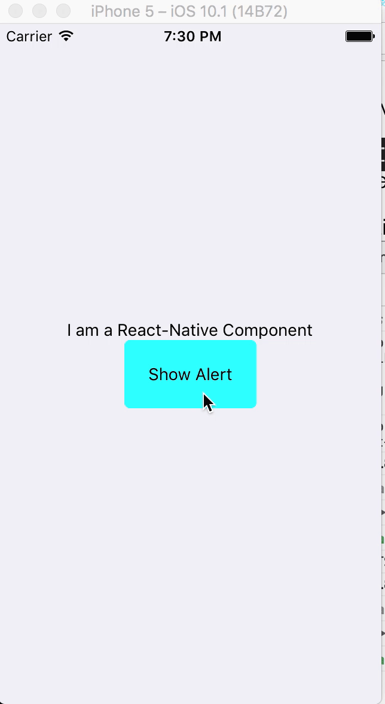

# rn-animate-alert

---
When the traditional Alert just isn't good enough
---
Gif quality not the greatest, but you get the picture...
---




`npm install --save rn-animate-alert`

- Put this as the bottommost component to overlay all other views.
- Wrap whatever content inside


#### Just copy the example and you'll see

```js
import React from 'react';
import { View, TouchableOpacity, AppRegistry, Text, StyleSheet } from 'react-native';
import Alert from 'rn-animate-alert';

const styles = StyleSheet.create({
  container:{
    flex:1,
    alignItems:'center',
    justifyContent:'center',
  },
  button:{
    borderRadius:5,
    padding:20,
    alignItems:'center',
    backgroundColor:'aqua'
  },
  buttonTwo:{
    borderRadius:5,
    padding:20,
    alignItems:'center',
    backgroundColor:'white'
  },
  overlayText:{
    color:'white',
    fontWeight:'700'
  }
})

export default class Example extends React.Component {

  constructor(){
    super();
    this.state={
      show: false
    }
  };

  toggleAlert = () => {
    this.setState({show:!this.state.show})
  }

  render(){
    return(
      <View style={ styles.container }>
        <Text>I am a React-Native Component</Text>
        <TouchableOpacity
          onPress={ this.toggleAlert }
          style={ styles.button }>
          <Text>Show Alert</Text>
        </TouchableOpacity>


        <Alert
        backgroundColor={ 'rgba(111,111,111,.5)' }
        show={ this.state.show }
        entrance={ 'fromBottom' }
        >
          <View style={ styles.container }>
            <Text>****I AM AN OVERLAY*****</Text>
            <TouchableOpacity
            onPress={ this.toggleAlert }
            style={ styles.buttonTwo }>
            <Text>Hide Alert</Text>
            </TouchableOpacity>
          </View>
        </Alert>
      </View>
    )
  };

};

AppRegistry.registerComponent('Example', () => Example);
```


### Props

| Prop | Type | Description | Required |
| ---  | ---  | ---         | ---      |
| entrance | enum oneOf `'fromTop'`,`'fromBottom'`,`'fromLeft'`,`'fromRight'` | how to enter | **YES** |
| backgroundColor | string | backgroundColor of overlay | **YES**|
| show | bool | whether to show this | **YES** |
