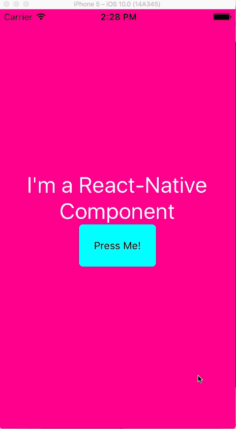

# rn-animate-alert

---
When the traditional Alert just isn't good enough
---
Gif quality not the greatest, but you get the picture...
---




`npm install --save rn-animate-alert`

- Put this as the bottommost component to overlay all other views.  See Example for how to accomplish this.

- Will not animate unless you specify what direction.

`springFromTop={true}` or `springFromBottom={true}`

#### Just copy the example and you'll see

```js
import React, { Component } from 'react';
import { View, TouchableOpacity, AppRegistry, Text } from 'react-native';
import Alert from 'rn-animate-alert';

export default class Example extends Component {

  constructor(){
    super();
    this.state={
      renderAlert: false
    }
  };


  render(){
    return(
      <View style={{
        flex:1,
        alignItems:'center',
        justifyContent:'center',
        backgroundColor:'deeppink'
      }}>
        <Text style={{color:'white',fontSize:30, textAlign:'center'}}>I am a React-Native Component</Text>
        <TouchableOpacity
          onPress={
            () => this.setState({renderAlert:true})
          }
          style={{
            borderRadius:5,
            padding:20,
            alignItems:'center',
            backgroundColor:'aqua'
          }}>
          <Text>Press Me!</Text>
        </TouchableOpacity>
        {this.renderAlert()}
      </View>
    )
  };

  renderAlert(){
    if (this.state.renderAlert) {
      return(
        <Alert
          title={'I\'m an alert and I animated in!!'}
          detailText={'Watch me animate out too!!'}

          springFromBottom={true}

          onConfirm={
            () => {
              console.log('do stuff');
              this.setState({renderAlert:false})
            }
          }
          onCancel={
            () => {
              console.log('Do other stuff');
              this.setState({renderAlert:false})
            }
          }/>
      )
    }
  };

};

AppRegistry.registerComponent('Example', () => Example);
```

#### There's a shit ton of props available to style this thing HOWEVER YOU WANT

### Props

| Prop | Type | Description | Required |
| ---  | ---  | ---         | ---      |
| onConfirm | function | function called when the confirm button is pressed | **YES** |
| onCancel | function | function called when the cancel button is pressed | **YES** |
| title | string | text displayed at the top of the alert | **YES** |
| titleTextStyle | object | styles applied to the title text | no |
| detailText | string | descriptive text displayed under the title | no |
| detailTextStyle | object | styles applied to the detail text | no |
| confirmText | string | text for the confirm button | no |
| confirmTextStyle | object | styles applied to the confirm text | no |
| confirmButtonStyle | object | styles applied to the confirm button | no |
| cancelText | string | text for the cancel button | no |
| cancelTextStyle | object | styles applied to the cancel text | no |
| cancelButtonStyle | object | styles applied to the cancel button | no |
| backgroundColor | string | color applied to the background of the overlay | no |
| containerStyle | object | styles applied to the container of the text and buttons | no |
| springFromBottom | boolean | should the alert spring from the bottom | no |
| spring from top | boolean | should the alert spring from the top | no |
